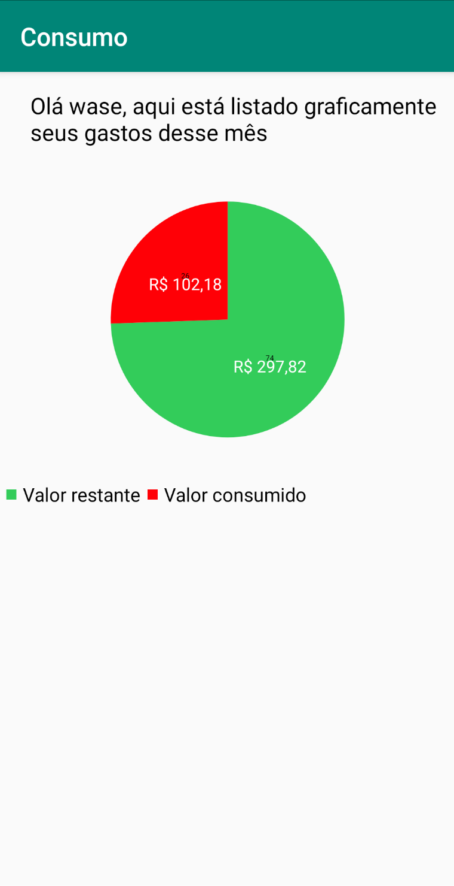

# Smart Energy
Este projeto é para a captação de dados de consumo de energia elétrica de uma casa atráves de um ESP8266.

O ESP8266 produzirá dados de consumo de energia e enviará para um aplicativo, no aplicativo será possível visualizar esses dados.

Vale ressaltar que o aplicativo foi feito em **Android Nativo com Java**.

O projeto ainda está em andamento.

## Screenshots

## Libraries
Este app utiliza as seguintes bibliotecas de terceiros:

* [MPAndroidChart](https://github.com/PhilJay/MPAndroidChart) - Para a visualização dos gráficos